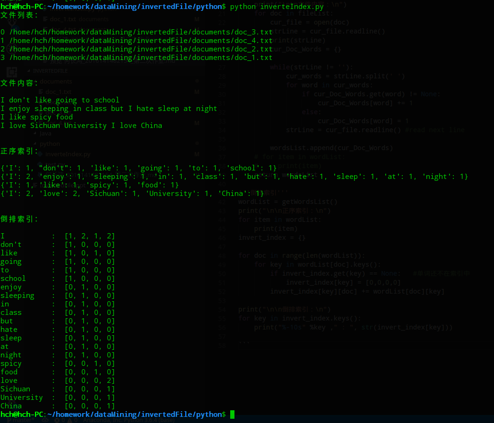

## <center>第二次作业
<center>何长鸿 2016141482154</center>

>1. 使用列表内嵌字典保存各个文件的单词索引（每个文件对应列表中的一个字典，字典键为单词，值为单词出现次数）
>2. 使用字典保存倒排索引结果，字典键为单词，值为四个文件出现次数的组合列表

```python
#coding:utf-8
import os, sys

'''获取文件列表'''
def getDocPath(path):
    documents = os.listdir(path)
    fileList = []
    print("文件列表：\n")
    for doc in documents:
        fileList.append(os.path.join(path,doc))
        index = len(fileList)-1 #获取当前文件路径下标
        print(index, fileList[index])
    return fileLists

'''获取每个文件的单词数统计'''
def getWordsList():
    wordsList=[] #使用列表保存每个文件的单词
    fileList = getDocPath("/home/hch/homework/dataMining/invertedFile/documents")
    print("\n\n文件内容：\n")
    for doc in fileList:
        cur_file = open(doc)
        strLine = cur_file.readline()
        print(strLine)
        cur_Doc_Words = {}

        while(strLine != ''):
            cur_words = strLine.split(' ')
            for word in cur_words:
                if cur_Doc_Words.get(word) != None:
                    cur_Doc_Words[word] += 1
                else:
                    cur_Doc_Words[word] = 1
            strLine = cur_file.readline() #read next line

        wordsList.append(cur_Doc_Words)
    # for item in wordList:
    #     print(item)
    return wordsList

'''倒排索引'''
wordList = getWordsList()
print("\n\n正序索引：\n")
for item in wordList:
    print(item)
invert_index = {}

for doc in range(len(wordList)):
    for key in wordList[doc].keys():
        if invert_index.get(key) == None:   #单词还不在索引中
            invert_index[key] = [0,0,0,0]
        invert_index[key][doc] += wordList[doc][key]

print("\n\n倒排索引：\n")  
for key in invert_index.keys():
    print("%-10s" %key ," : ", str(invert_index[key]))

```

> 运行结果


