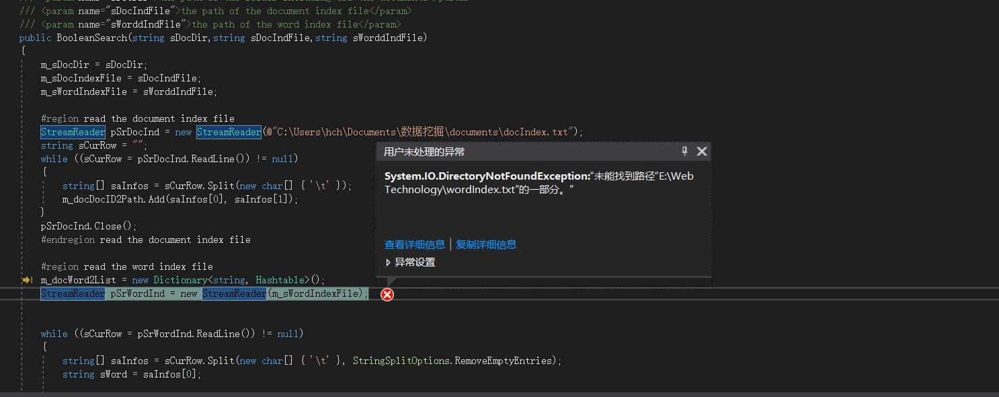

## 何长鸿 2016141482154

## 布尔检索

### 一、运行测试
1. 使用VS2017打开项目，运行时报错，提示目录不存在，查看代码中目录配置，修改成自己电脑的目录，再次运行依然提示相同的错误。
```cs
string m_sDocDir = @"C:\Users\hch\Documents\数据挖掘\documents";

string m_sDocIndexFile = @"C:\Users\hch\Documents\数据挖掘\documents\docIndex.txt";

string m_sWordIndexFile = @"C:\Users\hch\Documents\数据挖掘\documents\wordIndex.txt";

```

1. 重新构建项目运行，依然报错


1. 直接将代码中变量目录改为常量，并在目录创建对应文件夹。终于正常运行了。
```cs
 StreamReader pSrDocInd = new StreamReader(@"C:\Users\hch\Documents\数据挖掘\documents\docIndex.txt");
```


### 二、代码分析
1. BooleanSearch函数部分是从docIndex。txt和wordIndex.txt中读取文档列表和词汇列表信息，并使用List数据结构缓存。
1. SearchWithSingleKeyword中，对每个文档进行简单检索，如果包含目标词汇则直接返回这些文档集合列表
1. SearchWithBinaryTree函数中，递归遍历查找语句，语句中的 AND OR分别作为分支结点构建二叉树，相当于进行加减操作。检索文档时，and两边的条件需要同时满足，or两边只用满足一个，目标文档就符合要求，被加入到返回列表中。

### 三、感想
虽然这次成功运行，但是构建查找树这段代码细节理解并不是很深刻，对递归理解需要加强。关于布尔检索，如果能熟练写出代码的话，还是很实用的，以后在博客里面加个js插件。