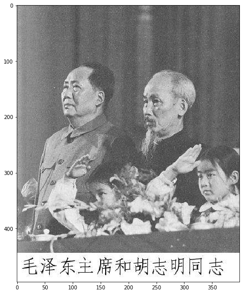
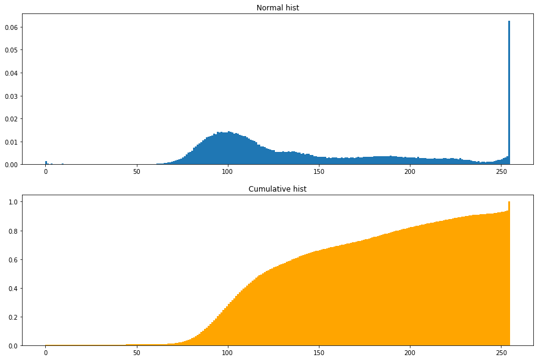
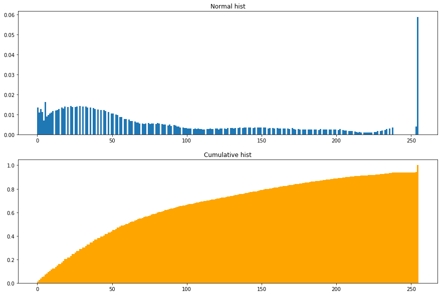
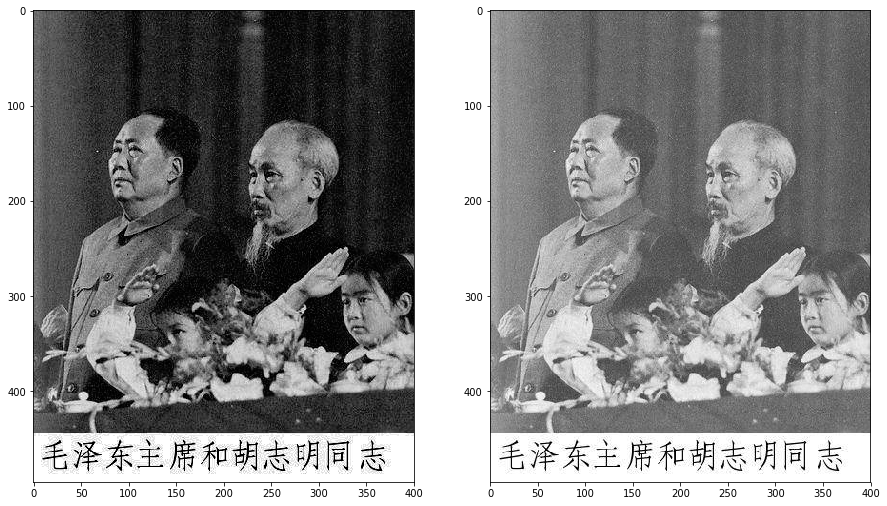

## <center>何长鸿
### <center>2016141482154


```python
import numpy as np
import matplotlib.pyplot as plt
import cv2
import pylab
pylab.rcParams['figure.figsize'] = (15.0, 10.0)
```

## <center>读取图像并灰度化


```python
img = cv2.imread('./timg.jpg')
img = cv2.cvtColor(img,cv2.COLOR_BGR2GRAY)
bak = img.copy()
fg = plt.figure()
plt.imshow(img,cmap='gray')
```


    <matplotlib.image.AxesImage at 0x1956dc7efd0>





## <center>直方图统计


```python
fg = plt.figure()
pl = fg.add_subplot(211)
ret1 = plt.hist(list(img.flat),bins=255,density=True,range=(0,255))
pl.set_title('Normal hist')
pl = fg.add_subplot(212)
ret2 = plt.hist(list(img.flat),bins=255,density=True,range=(0,255),cumulative=True,color='orange')
pl.set_title('Cumulative hist')
```


    Text(0.5,1,'Cumulative hist')





## <center>使用累计概率乘以相应灰度值，并映射到原图像


```python
hk,pixel = ret2[0],ret2[1]
hk=np.append(hk,1)
new_pixel = hk*pixel
new_pixel = new_pixel.astype(np.uint8)
for i in range(len(img)):
    for j in range(len(img[i])):
        img[i][j] = new_pixel[img[i]][j]
```

## <center>新图象直方图统计


```python
fg = plt.figure()
pl = fg.add_subplot(211)
ret1 = plt.hist(list(img.flat),bins=255,density=True,range=(0,255))
pl.set_title('Normal hist')
pl = fg.add_subplot(212)
ret2 = plt.hist(list(img.flat),bins=255,density=True,range=(0,255),cumulative=True,color='orange')
pl.set_title('Cumulative hist')
```


    Text(0.5,1,'Cumulative hist')





## <center>处理后与处理前照片对比


```python
fg = plt.figure()
fg.add_subplot(121)
plt.imshow(img,cmap='gray')
fg.add_subplot(122)
plt.imshow(bak,cmap='gray')
```


    <matplotlib.image.AxesImage at 0x1956ca63be0>





## <center>保存处理后图片


```python
cv2.imwrite('new_timg.jpg',img)
```


    True


